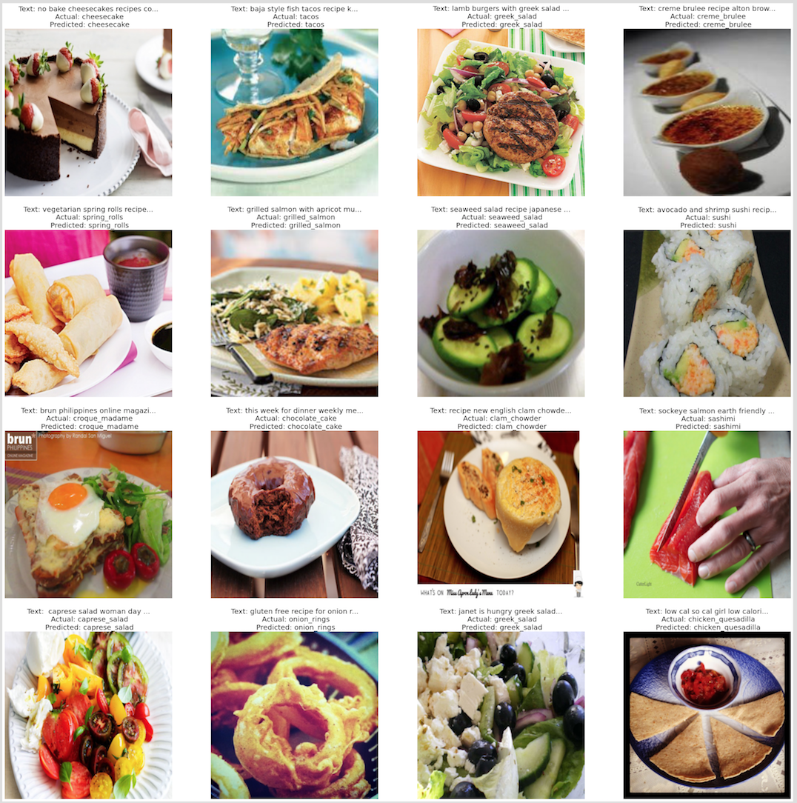
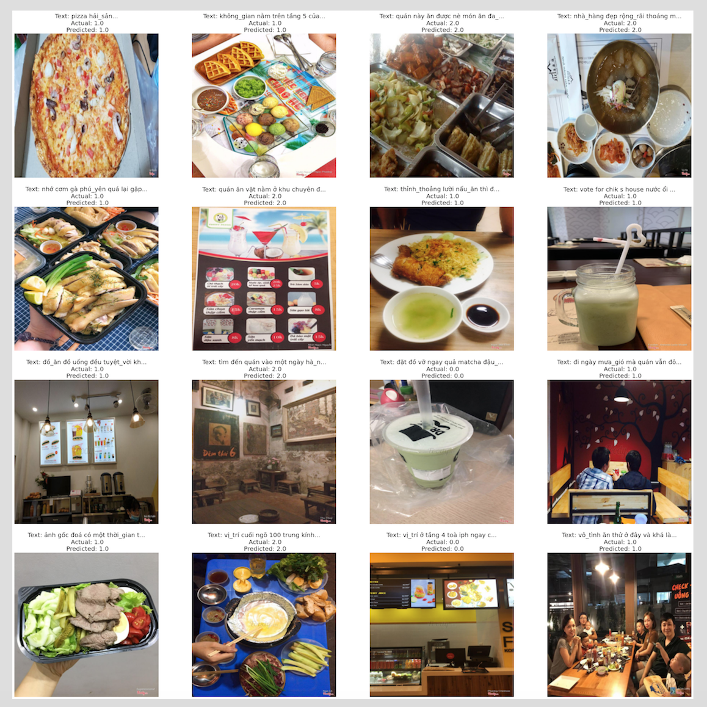

# Image-Text_Fusion_Multimodal
Pytorch implementation of the multimodal classifier for [food-101 data](http://visiir.lip6.fr/explore) described in the paper [Image and Text fusion for UPMC Food-101
using BERT and CNNs](http://artelab.dista.uninsubria.it/res/research/papers/2020/2020-IVCNZ-Gallo-Food101.pdf)

I also develop a new model based on the paper model for the Vietnamese [data](https://github.com/LENGHIA-CN8/FoodyCrawl) that I crawled from Foody for image text fusion sentiment-analysis task.

## Implementation
### UPMC model for the data food 101
[UPMC_Multimodal.ipynb](https://github.com/LENGHIA-CN8/Image-Text_Fusion_Multimodal/blob/master/UPMC_Multimodal.ipynb) 

### Research model for Foody sentiment analysis
[Multimodal.ipynb](https://github.com/LENGHIA-CN8/Image-Text_Fusion_Multimodal/blob/master/Multimodal.ipynb) 

## Result of implementation
### UPMC model
UPMC achieve 91,6% for accuracy metrics

### Research model
Research model achieve 81% for accuracy metrics

